# 📘 Multi-Agent Exploratory Data Analysis (EDA) System
A fully autonomous multi-agent architecture for end-to-end exploratory data analysis with report generation, visualization, data cleaning, and insight synthesis.

## ⭐ Table of Contents
1. Introduction
2. System Features
3. Architecture Overview
4. High-Level Architecture Diagram
5. Pipeline Sequence Diagram
6. Multi-Agent System Design
7. Detailed Agent Documentation
   - JSON/XML Normalizer Agent
   - Data Quality Agent
   - Data Exploration Agent
   - Relationship Discovery Agent
   - Data Storytelling Agent
   - LLM Orchestrator Agent
8. Agent Class Diagrams
9. Deployment Architecture
10. Container / Kubernetes Deployment Diagram
11. Installation
12. API Usage
13. Repository Structure
14. Testing
15. Extensibility
16. Citations

# 🧠 Introduction
This repository provides a complete implementation of a multi-agent system for Exploratory Data Analysis (EDA). The system enables automated:
- Dataset ingestion and normalization
- Data quality assessment and cleaning
- Statistical exploration and clustering
- Relationship discovery and correlation analysis
- AI-powered insight generation
- Interactive dashboard and report creation

It combines statistical analysis, machine learning, visualization libraries, LLM-powered insights, and multi-agent orchestration to produce a robust, extensible, and scalable EDA pipeline.

# 🚀 System Features
✔ Fully autonomous multi-agent workflow
✔ LLM-powered orchestration with dynamic planning
✔ JSON, XML, CSV, Excel dataset ingestion with auto-detection
✔ Comprehensive data quality assessment with Great Expectations
✔ Automated missing-value handling and outlier detection
✔ Smart imputation and duplicate removal
✔ Advanced clustering (K-means with auto cluster selection)
✔ Correlation analysis (Pearson, Spearman, Mutual Information)
✔ Regression analysis with visualizations
✔ AI-generated narrative insights
✔ Interactive Dash dashboards
✔ Professional HTML report generation
✔ REST API powered by FastAPI
✔ Containerized (Docker + Docker Compose)
✔ Supports cloud deployment

# 🏗 Architecture Overview
The system follows a hierarchical multi-agent architecture, coordinated by the LLM Orchestrator Agent.
- Each agent is autonomous with specialized functions
- Agents produce artifacts consumed by other agents
- LLM Orchestrator creates dynamic workflow plans
- A central SharedMemory object facilitates communication

# 🗺 High-Level Architecture Diagram
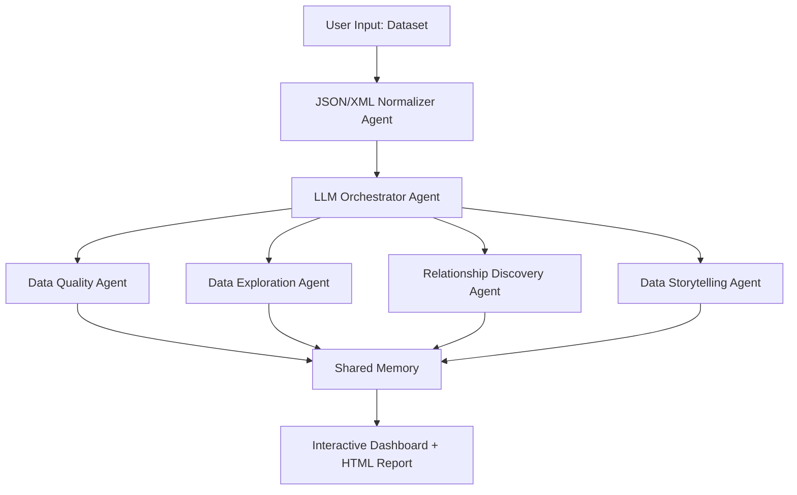

# 🔁 Pipeline Sequence Diagram
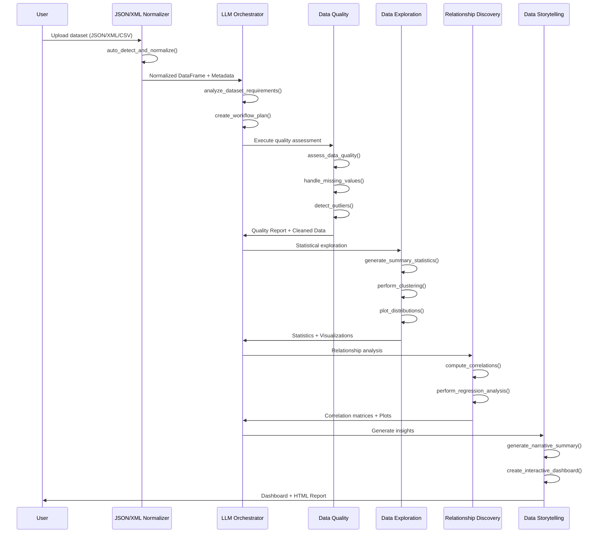

# 🤖 Multi-Agent System Design
The architecture uses six specialized agents coordinated by an LLM Orchestrator Agent.

🔹 Agents:

| Agent | Purpose | Key Functions |
|-------|---------|---------------|
| JSON/XML Normalizer Agent | Format detection and data normalization | auto_detect_and_normalize(), flatten_nested_columns() |
| Data Quality Agent | Quality assessment, cleaning, validation | assess_data_quality(), handle_missing_values(), detect_outliers() |
| Data Exploration Agent | Statistical analysis and clustering | generate_summary_statistics(), perform_clustering(), plot_distributions() |
| Relationship Discovery Agent | Correlation and relationship analysis | compute_correlations(), perform_regression_analysis(), compute_mutual_information() |
| Data Storytelling Agent | AI-powered insights and reporting | generate_narrative_summary(), create_interactive_dashboard() |
| LLM Orchestrator Agent | Workflow planning and coordination | create_workflow_plan(), execute_workflow() |

# 📚 Detailed Agent Documentation

## 📄 JSON/XML Normalizer Agent
**Purpose:**
- Auto-detect data format (JSON, XML, CSV, Excel)
- Convert structured data to normalized DataFrame
- Flatten nested structures
- Extract metadata

**Functions:**
- `normalize_json()` - Convert JSON to DataFrame
- `normalize_xml()` - Convert XML to DataFrame
- `auto_detect_and_normalize()` - Auto-detect format and normalize
- `flatten_nested_columns()` - Flatten nested data structures

**Diagram:**
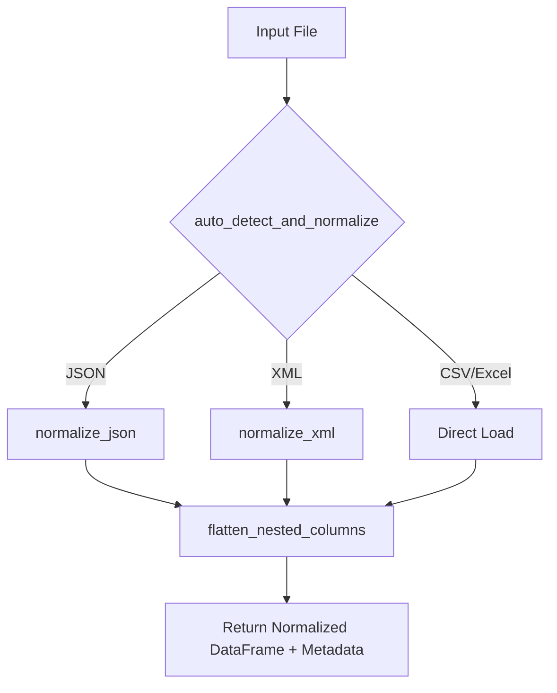

## ✅ Data Quality Agent
**Purpose:**
- Comprehensive data quality assessment
- Missing value imputation
- Duplicate detection and removal
- Outlier detection using statistical methods
- Feature encoding and normalization
- Data validation with Great Expectations

**Functions:**
- `assess_data_quality()` - Comprehensive quality report
- `identify_data_types()` - Categorize column types
- `handle_missing_values()` - Smart imputation strategies
- `handle_duplicates()` - Remove duplicate records
- `detect_outliers()` - Z-score & IQR methods
- `encode_categorical_features()` - Label/One-hot encoding
- `normalize_data()` - StandardScaler normalization
- `validate_with_great_expectations()` - Data validation framework

**Diagram:**
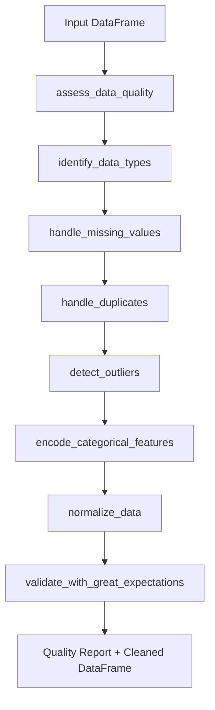

## 🔍 Data Exploration Agent
**Purpose:**
- Generate comprehensive statistical summaries
- Perform clustering analysis with auto cluster selection
- Create distribution visualizations
- Identify outliers with detailed analysis
- Generate categorical frequency plots

**Functions:**
- `generate_summary_statistics()` - Comprehensive statistical summary
- `identify_outliers()` - Outlier detection with detailed reports
- `plot_distributions()` - Histogram visualizations
- `plot_boxplots()` - Box plot analysis
- `plot_countplots()` - Categorical frequency plots
- `perform_clustering()` - K-means with automatic cluster selection
- `create_scatter_matrix()` - Pairwise scatter plot matrix

**Diagram:**
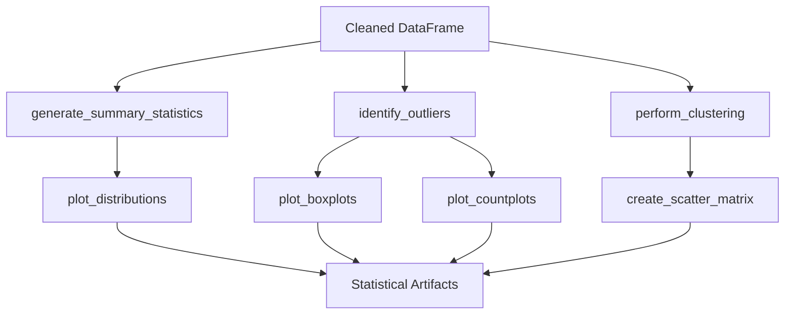

## 🔗 Relationship Discovery Agent
**Purpose:**
- Compute multiple correlation metrics
- Identify linear and non-linear relationships
- Perform regression analysis
- Generate relationship visualizations
- Find strong feature relationships

**Functions:**
- `compute_correlations()` - Pearson & Spearman correlations
- `plot_correlation_heatmap()` - Annotated correlation heatmap
- `plot_pairplot()` - Seaborn pairplot for relationships
- `plot_categorical_vs_numerical()` - Box plots by category
- `plot_boxplots_categorical_vs_numerical()` - Multiple category combinations
- `compute_mutual_information()` - Non-linear relationship detection
- `perform_regression_analysis()` - Linear regression with visualizations
- `identify_strong_relationships()` - Find high correlation pairs

**Diagram:**
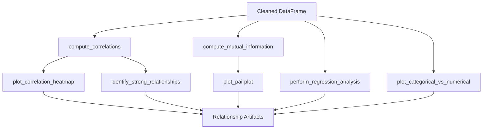

## 📊 Data Storytelling Agent
**Purpose:**
- Generate AI-powered narrative insights
- Create interactive dashboards
- Produce professional HTML reports
- Synthesize findings from all agents
- Provide fallback narratives without LLM

**Functions:**
- `generate_narrative_summary()` - AI-powered insights using LLM
- `generate_summary_insights()` - Extract key findings
- `create_interactive_dashboard()` - Full Plotly Dash dashboard
- `create_summary_report()` - Professional HTML report generation
- `_generate_fallback_narrative()` - Non-LLM backup narrative

**Diagram:**
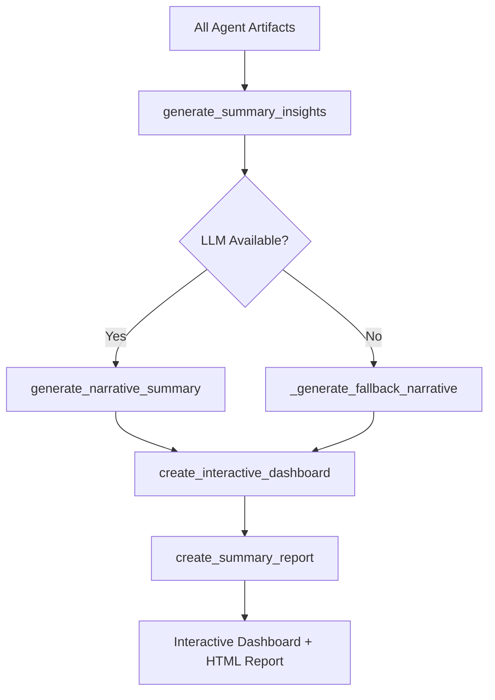

## 🎯 LLM Orchestrator Agent
**Purpose:**
- Initialize and coordinate all agents
- Analyze dataset requirements dynamically
- Create optimal workflow plans using LLM or rules
- Execute complete EDA workflow
- Manage shared memory and artifacts

**Functions:**
- `initialize_agents()` - Setup and initialize all agents
- `analyze_dataset_requirements()` - Analyze dataset characteristics
- `create_workflow_plan()` - LLM-based or rule-based workflow planning
- `execute_workflow()` - Complete EDA pipeline execution

**Diagram:**
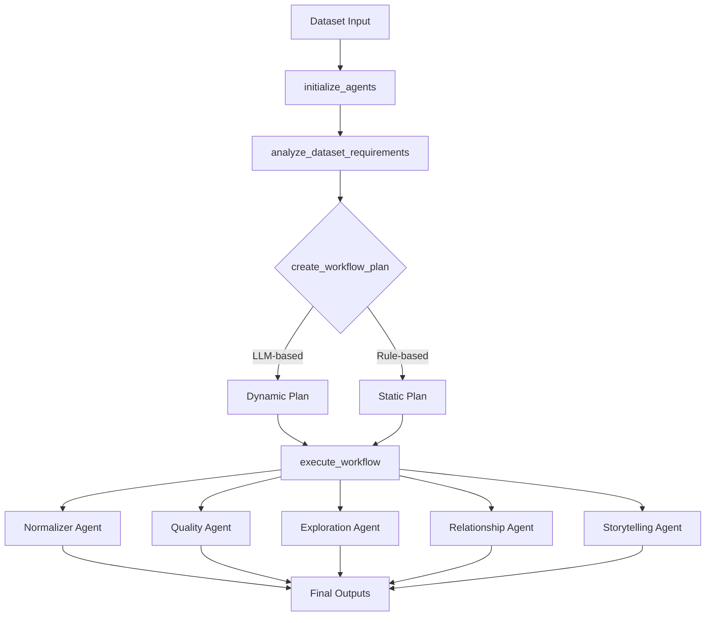

# 🧩 Agent Class Diagrams
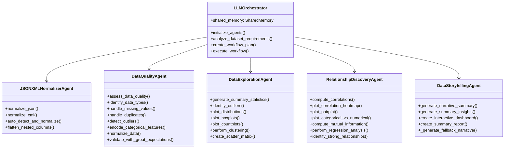

# ☁ Deployment Architecture
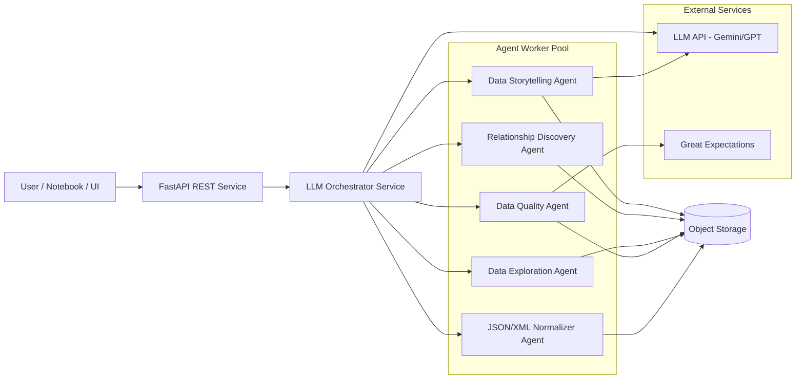

# 🐳 Container / Kubernetes Deployment Diagram
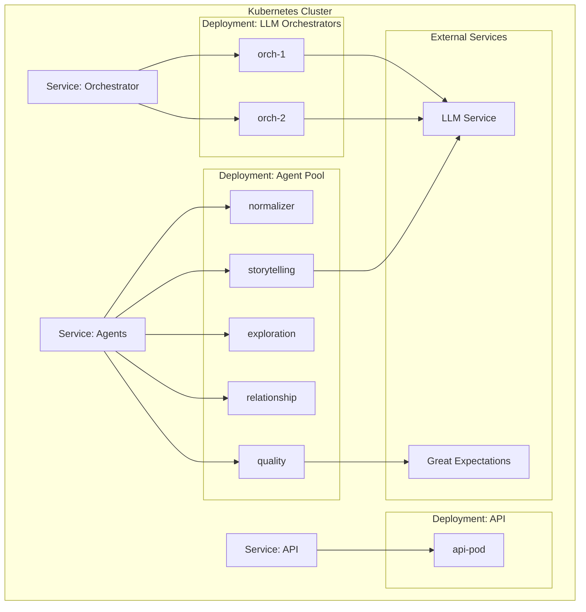

# 🛠 Installation
Clone repository:
```bash
git clone https://github.com/eaamankwah/multi-agent-eda-system
cd multi-agent-eda-system
```

Install requirements:
```bash
pip install -r requirements.txt
```

Set up environment variables:
```bash
# Create .env file
echo "GEMINI_API_KEY=your_api_key_here" > .env
echo "GREAT_EXPECTATIONS_HOME=./ge_configs" >> .env
```

# 🌐 Run API Server
```bash
uvicorn src.app:app --reload
```

# 🔌 API Usage
Run EDA via cURL:
```bash
curl -X POST -F "file=@dataset.csv" http://127.0.0.1:8000/eda/run
```

Run with JSON data:
```bash
curl -X POST -F "file=@data.json" http://127.0.0.1:8000/eda/run
```

Run with XML data:
```bash
curl -X POST -F "file=@data.xml" http://127.0.0.1:8000/eda/run
```

# 📁 Repository Structure

```
multi-agent-eda-system/
multi-agent-eda-system/
│
├── deployment files/
│   ├── app.py                                      # FastAPI application
│   ├── cloudbuild.yaml                             # Cloud Build configuration
│   ├── DEPLOYMENT_GUIDE.md                         # Deployment documentation
│   ├── Dockerfile                                  # Container definition
│   ├── eda_results.json                            # Sample EDA results
│   ├── eda_summary_report.html                     # Sample HTML report
│   ├── evaluation_report.txt                       # Evaluation metrics
│   └── requirements.txt                            # Python dependencies
│
├── docker-compose.yml                              # Docker Compose configuration
├── Dockerfile                                      # Main Dockerfile
│
├── docs/
│   ├── architecture.md                             # System architecture
│   ├── deployment.md                               # Deployment guide
│   └── usage_guide.md                              # User guide
│
├── images/
│   ├── agent system gallery.png                    # Agent system overview
│   ├── agent system gallery2.png                   # Agent interactions
│   ├── agent system gallery3.png                   # Workflow visualization
│   ├── agent system gallery4.png                   # Results dashboard
│   ├── architecture diagram.png                    # Architecture diagram
│   ├── deployment architecture.png                 # Deployment architecture
│   ├── Gemini_Generated_multi-agent eda system.png # Gemini generated diagram
│   ├── llm orchestrator agent.png                  # Orchestrator agent diagram
│   ├── pipeline sequence diagram.png               # Pipeline sequence flow
│   └── repo structure.png                          # Repository structure
│   └── multi-agent system test coverage.jpeg       # Test system coverage
│
├── Multi_Agent_Exploratory_Data_Analysis_System.html  # Main documentation
├── Multi_Agent_Exploratory_Data_Analysis_System.ipynb # Jupyter notebook
├── Multi_Agent_Exploratory_Data_Analysis_System.py    # Python script version
│
├── README.md                                       # This file
├── requirements.txt                                # Python dependencies
│
├── src/
│   ├── agents/
│   │   ├── exploration_agent.py                    # Data Exploration Agent
│   │   ├── normalizer_agent.py                     # JSON/XML Normalizer Agent
│   │   ├── quality_agent.py                        # Data Quality Agent
│   │   ├── relationship_agent.py                   # Relationship Discovery Agent
│   │   └── storytelling_agent.py                   # Data Storytelling Agent
│   │
│   ├── app.py                                      # FastAPI application entry
│   │
│   ├── orchestrator/
│   │   └── llm_orchestrator.py                     # LLM Orchestrator Agent
│   │
│   └── utils/
│       ├── config.py                               # Configuration settings
│       └── shared_memory.py                        # Shared memory manager
│
└── tests/
    └── test_agents.py                              # Agent unit tests
    └── test_normalizer.py                          
    └── test_quality.py                              
    └── test_exploration.py  
    └── test_relationship.py  
    └── test_storytelling.py                                                       
```

# 🧪 Testing

Run all tests:
```bash
pytest tests/ -v
```

Run specific multi-agent system test coverage:
```bash
pytest tests/test_normalizer.py -v
pytest tests/test_quality.py -v
pytest tests/test_exploration.py -v
pytest tests/test_relationship.py -v
pytest tests/test_storytelling.py -v
```

# 🧩 Extensibility
You may extend the system by adding:

🔹 **Additional Agents**
- Feature Engineering Agent - Advanced feature creation and selection
- Time Series Analysis Agent - Temporal pattern detection
- Model Training Agent - AutoML integration
- Data Drift Agent - Monitor data distribution changes
- Anomaly Detection Agent - Advanced outlier detection

🔹 **Frontend Dashboard**
- React dashboard for interactive exploration
- Streamlit interface for quick prototyping
- Jupyter notebook integration

🔹 **Enhanced LLM Integration**
- Multi-model support (GPT-4, Claude, Gemini)
- Fine-tuned models for domain-specific insights
- Multi-turn reasoning for deeper analysis
- Chain-of-thought prompting for complex queries
- Model Context Protocol for improved performance

🔹 **Advanced Features**
- Real-time streaming data support
- Distributed processing with Dask
- GPU acceleration for large datasets
- MLflow integration for experiment tracking

# 📚 Citations

- Provost, Fawcett — Data Science for Business
- McKinney — Python for Data Analysis
- Scikit-Learn Documentation
- Pandas Documentation
- Plotly & Dash Documentation
- Great Expectations Documentation
- FastAPI Documentation
- Seaborn & Matplotlib Documentation
- Google DeepMind Gemini Papers
- OpenAI GPT Documentation